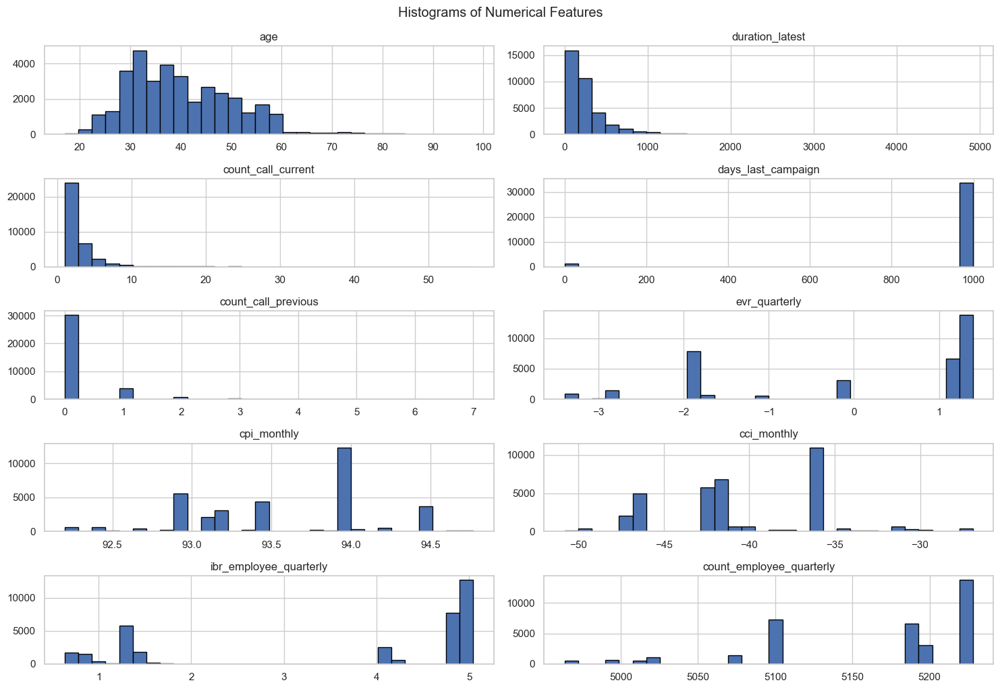
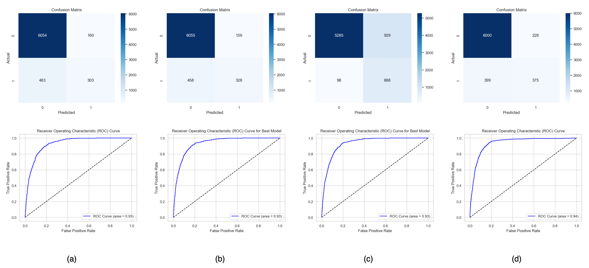

# ARCH CASE STUDY

Proponent: Ricky Jay Gomez

## Executive Summary

## Overview

Our client is an insurance company with large global operations offering insurance, reinsurance, and mortgage insurance. The company has reached out to ask for our expertise in developing a predictive model to optimize sales efforts and maximize company revenue. Initially, they conducted a review on their sales data using their dataset against their in-house developed model and predictive modeling approaches (methodology). As a predictive service provider, they tasked our team to build a predictive model using the same dataset that they used in their review process to verify if their in-house developed model provides sound business insights. There are no specific criteria about the modeling approach that we will use, but they provided a list of some important things to consider as we build our model— mostly covers topics related to data pre-processing, model training & validation, interpretability & generalization, and optimization & evaluation.

## Problem Statement

Our team achieves its success once these important business questions from our client are answered:

- How can we identify which customers are most likely to accept the sales offer when the contact center calls them, so we optimize the sales team effort and reduce wasted call?
- How can we prioritize leads so that we maximize conversion rates and sales performance?
- How will using this developed model affect overall ROI— i.e., the balance of campaign costs vs. sales revenue?

## Objectives

In this project, our team aims:

- To discriminate customers between who will or will not likely to take the sales offer once they are cold called by building a predictive model capable of classifying leads.
- To assess the financial impact of the developed model based on its classification outcomes by quantifying revenue gains, cost savings, lost opportunites, and the cost of incorrect predictions.

## Methodology and Modeling Framework

### Framework

This work follows the modeling framework in the figure below.

Figure 1: Modeling Framework

Here is the step-by-step procedure of the modeling process:

- It started with the data acquisition where the dataset was requested from the client as .csv file.
- The dataset was analyzed through conducting a full-blown Exploratory Data Analysis wherein data were loaded, datatypes were inspected, and column names were fixed for better readability and processing during the EDA. Few checks were done including the Target Variable Analysis, Missing Values and Data Types, Numerical Feature Analysis, Categorical Feature Analysis, and Target-wise Analysis.
- Based on the EDA outcomes, data was pre-processed by feature transformation, scaling, and normalization. These were done to make sure that categorical features are encoded with numerical representations, and numerical features were scaled and normalized to avoid discriminating power in some features.
- The iterative process of training, evaluating, and optimizing the models was applied to make sure that we get the model with best possible outcomes, especially when profitability is considered.
- Lastly, final business insights were summarized to help our client make informed decisions about their company's sales effort and profit maximization.

### Dataset

Our client provided a sales dataset consisting of 35,000 total number of observations with 10 numerical features, 10 categorical features, and 1 binary response variable (0s for No-Buys and 1s for Buys). Based on the initial view of the response variable, there is a severe class imbalance observed wherein 88.77% belong to No-buys and only 11.23% belong to Buys. There is no information about the unique identification for each record that would help us infer about the granularity of the dataset, and temporal data for time effects. Some numerical features were scaled and normalized to make sure that any discriminating power based on the differences in their scales does not affect the model performance. Categorical features were encoded numerically, but the choice of which method should be used depends on the type of the data distribution, business context, and other factors. EDA results supplement the data pre-processing to make sure that model performance is optimized from the dataset level.

### Exploratory Data Analysis

#### Target Variable Analysis

The response rate was observed to have a severe class imbalance where No-Buys (88.77%) class has dominated Buys (11.23%) class.

#### Missing Values

There are no missing values detected across all features.

#### Numerical Feature Analysis

Table 1 shows the summary of the desciptive statistics of all the numerical features and the observations drawn from them. Whereas, Figure 2 supports the summary statistics with visualized data distributions for each feature through their histograms.

Table 1: Numerical Feature Summary Statistics
| Feature | Statistics | Observations | Action Items |
| :-----: | :--------: | :----------: | :----------: |
| age | Min/Max: 17 to 98 Mean/Median: 40.03 vs. 38.00 | - Reasonable data range - Slightly right skewed | |
| duration_latest | Mean: 257.8 Max: 4918 Std. Dev.: 258.6 |  - Strongly right skewed with a very long tail - High variance | |
| count_call_current | Mean: 2.56 Max: 56 75%: 3 | - Most values are low with few extreme outliers | |
| days_last_campaign | Mean: 962 25-75%: 999 | - 999 is used to encode "no previous campaign" | |
| count_call_previous | Mean: 0.17 75%: 0 Max: 7 | - Most values are zeros - Maximum value are found to be rare cases with high contact | |
| evr_quarterly | Min: -3.4 Max: 1.4 | - Slightly left skewed - With high variance relative to mean | |
| cpi_monthly | Min/Max: 92.2 to 94.8 Std. Dev.: 0.58 | - Tigh range and variability | |
| cci_monthly | Min/Max: -50.8 to -26.9 | - Negative values observed (normally seen for CCIs) | |
| ibr_employee_quarterly | Min/Max: 0.63 to 5.04 Median: 4.86 | - Likely bimodal distribution | |
| count_employee_quarterly | Min/Max: 4963.6 to 5228.1 Mean: 5167.04 Std. Dev.: 72.17 | - Relatively low standard deviation compared to mean value cautions static, low variance feature | |

Figure 2: Histogram of Numerical Features

Based on the boxplots, numerical features such as age, duration_latest, count_call_current, days_last_campaign, and count_call_previous were found to have a lot of outliers that go beyond the extreme values. Others such as evr_quarterly, cpi_monthly, cci_monthly, ibr_employee_quarterly, and count_employee_quarterly were found to have little to no outlier in their data.

Correlation heatmaps were also analyzed to check the correlation of each feature with the target as summarized in Table 2:

- duration_latest was found to exhibit highest postive correlation with the target. It implies that customers who stay longer on the call are more likely to buy than those who do not.
- More calls in previous campaign is observed to increase the probability of a customer taking the sales offer based on the moderate positive relationship between count_call_previous and target.
- The feature cci_monthly has a weak positive correlation with the target and might not be a strong predictor of the sales outcome on its own.
- Similarly, age has been perceived to have negligible effect on the customer's buying decision as well, but indicates that older people are more likely to buy based on its positive correlation with the target.
- In contrary to the one observed from the count_call_previous, count_call_current has showed a slightly inverse effect on the customer's buying decions; meaning, frequent calling might annoy customers or reflect unproductive efforts. However, the magnitude of their relationship with the target is higher for count_call_previous which might indicate that more wins could predominate based on the previous call frequencies.
- A moderately negative effect of evr_quarterly on the target could reflect economic slowdown dampering buying behavior.
- Similar observation was seen with ibr_quarterly as with the evr_quarterly which might be possibly linked to economoic conditions.
- Moderately negative effect of the number of employees was seen which may indicate structural economy-wide trends.
- A weak negative effect of cpi_monthly on the buying decision could imply that customers might be sensitive to price changes and inflation, but other factors might be influential to their final buying behavior.

Table 2: Numerical Feature to Target Correlation
| Feature | Correlation Coefficient | Observations |
| :-----: | :--------: | :----------: |
| age | +0.03 | Weak positive |
| duration_latest | +0.41 | Strong positive |
| count_call_current | –0.07 | Weak negative |
| days_last_campaign | –0.32 | Moderate negative |
| count_call_previous | +0.23 | Moderate positive |
| evr_quarterly | –0.30 | Moderate negative |
| cpi_monthly | –0.14 | Weak negative |
| cci_monthly | +0.05 | Weak positive |
| ibr_employee_quarterly | –0.31 | Moderate negative |
| count_employee_quarterly | –0.35 | Moderate negative |

Correlation among the features were also investigated to verify if multi-collinearity exist which could affect the model performance. The highest correlation among numerical features was seen between evr_quarterly and ibr_employee_quarterly with correlation coefficient of +0.97, indicating a strong positive relationship between them. On the other hand, ibr_employee_quarterly and count_employee_quarterly were seen to have a strong positive correlation of +0.95. Whereas, evr_quarterly and count_employee_quarterly with another strong positive correlation of +0.91. Although not as strong as the other three relationships, a significant correlation between the days_last_campaign and the count_call_previous was also seen with correlation coefficient value of +0.59. To confirm the reliability of these observations, Variance Inflation Factor (VIF) analysis was also conducted. The result showed that ibr_employee_quarterly, evr_quarterly, and count_employee_quarterly are the numerical features with the highest VIF values (greater than 10), which is aligned to the initial observation of multi-collinearity via correlation analysis.

#### Categorical Feature Analysis

Table 3 shows the structure of each categorical feature based on their cardinality, composition, and some unique observations.

Table 3: Categorical Features Structure
| Feature | Cardinality | Observations |
| :-----: | :--------: | :----------: |
| type_employment | 12 | - Classes with <3% frequency: cat_3, cat_10, cat_8, and cat_11 Cat_8 has a strong signal (31.8% Buy Rate) against the target |
| civil_status | 4 | - Cat_2 and Cat_3 have the highest response rates while Cat_1 and Cat_2 are the most frequent classes |
| highest_educ | 8 | - Uneducated (Cat_6) and Unknown (Cat_7) groups show higher-than-average buy rates, especially compared to certain bachelor's degree holders (e.g., Cat_2 at only 7.8%) - Top 3 categories (Cat_6, Cat_3, Cat_2) already cover nearly 70% of the dataset — enough for stable pattern recognition during training - Higher education doesn’t always lead to higher buy probability in this dataset — e.g., Cat_2 (likely a bachelor's group) has one of the lowest response rates - Rare Category (Cat_4): While it shows a high buy rate (23.5%), it's just 0.05% of data |
| credit_facility | 3 | -Strong separation between Cat_0 (higher buy rates) vs Cat_1 |
| home_loan | 3 | - Class separation is not strong but could still be predictive |
| personal_loan | 3 | - Weak class separation (super close buy rates across classes) but still worth keeping |
| contact_medium | 2 | - High-value predictor due to strong class separation and highly balanced representation |
| month_last_contacted | 10 | - Highly information feature due to strong class separation and seasonality |
| dow_last_contacted | 5 | - Class separation isn't strong but still worth keeping |
| previous_campaign | 3 | - Strong class separation |

#### Target-wise Analysis

Table 4 shows the summary of the signal strength of the target variable in each numerical feature through mean and median aggregation.

Table 4: Numerical features by target
| Feature | Signal Strength | Reason |
| :-----: | :--------: | :----------: |
| duration_latest | 4 | Strong separation |
| count_call_previous | 3 | Higher in buyers |
| days_last_campaign | 2 | Buyers contacted more recently |
| evr_quarterly | 2 | Positive macroeconomic effect |
| count_call_current | 2 | Higher for non-buyers |
| age | 1 | Weak separation |
| cpi_monthly, cci_monthly, ibr_employee_quarterly, count_employee_quaterly | Low signal | Might not be informative |

On the other hand, categorical features observed with high degree of separation between target classes signifying highly informative predictors include the following:

- type_employment
- civil_status
- highest_educ
- credit_facility
- contact_medium
- month_last_contacted
- previous_campaign

### Feature Transformation

For the feature transformations, both duration_latest and count_call_current underwent Box-Cox transformations for scaling and normalization. The days_last_campaign variable was converted into binary indicator (0 for no previous contact and 1 for previous contact). Features ibr_employee_quarterly and count_employee_quarterly were removed due to high collinearity with other variables. Records with credit_facility = Cat_2 were excluded since they represented only 0.0086% of the dataset and were all No-Buys, resulting in a new dataset size of 34,997 records. For categorical variables, type_employment, highest_educ, and month_last_contacted were target encoded for logistic regression and frequency encoded for tree-based models. Whereas, civil_status, home_loan, personal_loan, contact_medium, dow_last_contacted, and credit_facility were one-hot encoded across both models since they have relatively lower cardinality compared to other features. The previous_campaign feature was ordinal encoded for both models to give higher importance for successful previous campaigns. All other features not mentioned were retained in their original form. Overall, there are two separate datasets produced from the data pre-processing used in training both the logistic regression and tree-based models wherein new sets are composed of 25 features and 1 target variable.

### Train-Test Split

The dataset was divided into train and test data by 80%-20% alotment. Sets were randomly sampled, random seed was initiated for reproducibility of the modeling results, and the dataset was stratified by y to better handle class imbalance and maintain their original proportions during the learning process.

### Training Algorithms

This work solves a binary classification problem for predicting whether or not a customer will take the sales offer during cold calls, as affected by various numerical and categorical features and a highly imbalanced target variable. Given this, our team decided to use Logistic Regression, Generalized Linear Model (GLM) with Logit link function, and tree-based models including Random Forest and Extreme Gradient Boosting (XGBoost) algorithms for this task. Here are some of the qualifications of each algorithm for our use case:

1. Logistic Regression:

- Provides probability outputs that are directly usable for customer prioritization;
- Highly interpretable: coefficients can be explained to business users; and
- Serves as a strong baseline model for binary classification tasks.

2. GLM-logit:

- Similar to Logistic Regression, but with statistical inference tools;
- Helps validate whether features are statistically significant, which is useful for explaining why certain factors matter; and
- Complements Logistic Regression as a validation model against the client's in-house methodology.

3. Random Forest:

- Handles nonlinear relationships and interactions between features;
- More robust to noise and outliers compared to logistic models;
- Provides feature importance rankings, useful for identifying drivers of customer buying behavior; and
- Good as a benchmark ensemble model that improves Logistic Regression performance.

4. XGBoost:

- Very strong at handling imbalanced datasets, which matches the composition of the target variable in the dataset;
- Captures complex interactions between features better than Random Forest model;
- Provides well-calibrated probabilities (especially when tuned), which are critical for ROI simulation; and
- Works well with SHAP values for interpretability, making it a powerful production-ready choice.

## Model Development

### Logistic Regression

The model training begins with loading the pre-processed dataset intended for Logistic Regression model as dataframes. The features and target variables were segregated and split into training and test sets based on the planned proportions.

The model training process was executed in the following sequence:

1. Initial model was instantiated and fitted to the training dataset using hyperparameters including random_state, max_iter, and n_jobs with values of 42, 1000, and -1, respectively.
2. The model was used to predict target values against the test dataset, and was evaluated by producing performance metrics such as confusion matrix, classification report, ROC AUC score, and accuracy score. ROC curve was generated to visualize the trend of the relationship between true positive rate and false positive rate at default threshold of 0.50.
3. To improve the model performance based on the initial result of model evaluation, hyperparameter tuning was done to optimize the model hyperparameters by setting up parameter distribution and plugging them into a Randomized Search Cross Validation method.
4. The best model was used to predict target values based on the test dataset feature values and further evaluated using the same metrics.
5. The initial improved model was optimized for precision scoring; whereas, the second improved model was optimized for average precision scoring. Alongside, average precision and PR Curve AUC scores were also assessed for additional context during the model evaluation process.
6. Finally, profitability analysis was carried out to investigate the profitability of using the models developed against our client's business context and objectives. Threshold values were optimized to maximize the gains from each risk band based on the risk assessment conducted by the sales team and its corresponding insights as additional context that we used for the calculating models' profitability estimates. Overall, three different model iterations were produced using Logistic Regression.

Table 5 shows the summary of the model hyperparameters used during the model training process.

Table 5: Logistic Regression Hyperparameters for Random Search CV
| Hyperparameter | LR: precision | LR: avg. precision |
| :-------------: | :--: | :--: |
| random_state | 42 | 42 |
| max_iter | 1000 | 1000 |
| n_jobs | -1 | -1 |
| C | 100 | 100 |
| penalty | l1 | l2 |
| solver | liblinear | liblinear |
| class_weight | None | balanced |
| n_iter | 10 | 10 |
| scoring | precision | avg. precision |
| cv | 5 | 5 |

### Generalized Linear Model with logit Link Function

## Model Evaluation

### Performance

Figure 3: Logistic Regression Confusion Matrices and ROC Curves: (a) Naive LR, (b) Precision-optimized LR, (c) Avg. Precision-optimized LR

## Results and Discussions

## Conclusions

## Recommendation
