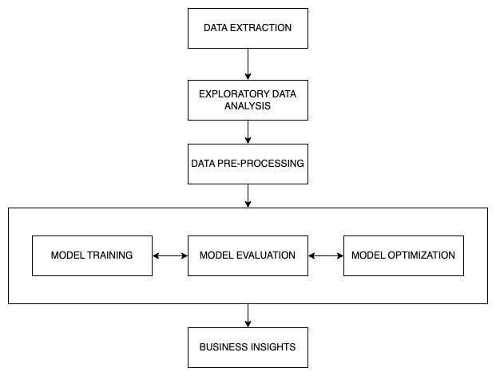

# ARCH CASE STUDY

Proponent: Ricky Jay Gomez

## Executive Summary

## Overview

Our client is an insurance company with large global operations offering insurance, reinsurance, and mortgage insurance. The company has reached out to ask for our expertise in developing a predictive model to optimize sales efforts and maximize company revenue. Initially, they conducted a review on their sales data using their dataset against their in-house developed model and predictive modeling approaches (methodology). As a predictive service provider, they tasked our team to build a predictive model using the same dataset that they used in their review process to verify if their in-house developed model provides sound business insights. There are no specific criteria about the modeling approach that we will use, but they provided a list of some important things to consider as we build our model— mostly covers topics related to data pre-processing, model training & validation, interpretability & generalization, and optimization & evaluation.

## Problem Statement

Our team achieves its success once these important business questions from our client have been answered:

- How can we identify which customers are most likely to accept the sales offer when the contact center calls them, so we optimize the sales team effort and reduce wasted call?
- How can we prioritize leads so that we maximize conversion rates and sales performance?
- How will using this developed model affect overall ROI— i.e., the balance of campaign costs vs. sales revenue?

## Objectives

In this project, our team aims:

- To discriminate customers between who will or will not likely to take the sales offer once they are cold called by building a predictive model capable of classifying leads.
- To assess the financial impact of the developed model based on its classification outcomes by quantifying revenue gains, cost savings, lost opportunites, and the cost of incorrect predictions.

## Methodology and Modeling Framework

### Framework

This work follows the modeling framework in the figure below.

Figure 1: Modeling Framework

Here is the step-by-step procedure of the modeling process in this work:

- It started with the data acquisition where the dataset was requested from the client as .csv file.
- The dataset was analyzed through conducting a full-blown Exploratory Data Analysis wherein data were loaded, datatypes were inspected, and column names were fixed for better readability and processing during the EDA. Few checks were done including the Target Variable Analysis, Missing Values and Data Types, Numerical Feature Analysis, Categorical Feature Analysis, and Target-wise Analysis.
- Based on the EDA outcomes, data was pre-processed by feature transformation, scaling, and normalization. These were done to make sure that categorical features are encoded with numerical representations, and numerical features were scaled and normalized to avoid discriminating power in some features.
- The iterative process of training, evaluating, and optimizing the models was applied to make sure that we get the model with best possible outcomes, especially when profitability is considered.
- Lastly, final business insights were summarized to help our client make informed decisions about their company's sales effort and profit maximization.

### Dataset

Our client provided a sales dataset consisting of 35,000 total number of observations with 10 numerical features, 10 categorical features, and 1 binary response variable (0s for No-Buys and 1s for Buys). Based on the initial view of the response variable, there is a severe class imbalance observed wherein 88.77% belong to No-buys and only 11.23% belong to Buys. There is no information about the unique identification for each record that would help us infer about the granularity of the dataset, and temporal data for time effects. Some numerical features were scaled and normalized to make sure that any discriminating power based on the differences in their scales does not affect the model performance. Categorical features were encoded numerically, but the choice of which method should be used depends on the type of the data distribution, business context, and other factors. EDA results supplement the data pre-processing to make sure that model performance is optimized from the dataset level.

## Model Development

## Model Evaluation

## Hyperparameter Tuning

## Conclusion

## Recommendation
